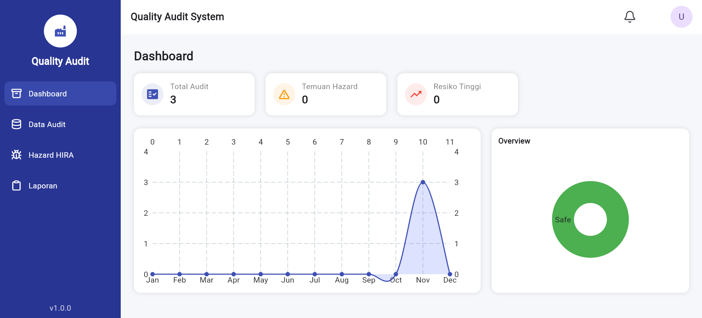
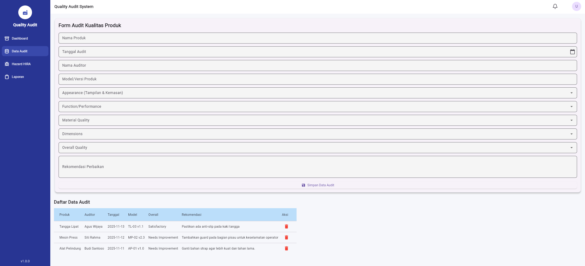
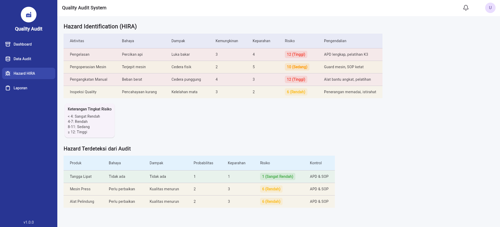

# Quality Audit System

Aplikasi berbasis **Flutter + Firebase** yang dirancang khusus untuk mendukung digitalisasi proses **Audit K3 (Keselamatan dan Kesehatan Kerja)**. Sistem ini memungkinkan auditor untuk mendeteksi bahaya secara real-time, melakukan penilaian risiko, dan memantau tren keselamatan melalui dashboard interaktif.

---

## Tampilan Aplikasi

### 1. Dashboard Utama
Menampilkan ringkasan statistik seperti total audit yang dilakukan, temuan hazard, dan status risiko. Dilengkapi dengan grafik tren bulanan untuk analisis performa K3.

  

### 2. Formulir Audit Kualitas
Antarmuka untuk entri data audit produk yang mencakup berbagai parameter penilaian mulai dari aspek fungsional hingga material, terintegrasi langsung dengan database.

  

### 3. Hazard Identification (HIRA)
Modul penilaian risiko menggunakan metode **HIRA** (Hazard Identification and Risk Assessment). Sistem secara otomatis menghitung tingkat risiko (Rendah, Sedang, Tinggi) berdasarkan probabilitas dan keparahan.

  

---

## Fitur Utama

- **Digital Audit Form**: Migrasi dari kertas ke digital dengan validasi data yang akurat.
- **Automated Risk Scoring**: Perhitungan otomatis tingkat bahaya (Risk Level) secara instan saat data dimasukkan.
- **Interactive Dashboard**: Visualisasi data menggunakan *Line Chart* dan *Donut Chart* untuk kemudahan monitoring.
- **Real-time Synchronization**: Menggunakan **Firebase Firestore** untuk sinkronisasi data antar perangkat.
- **Responsive Interface**: Optimal untuk penggunaan di tablet lapangan maupun dashboard desktop.

---

## Alur Kerja Sistem

1. **Input**: Auditor mengisi data pemeriksaan kualitas dan temuan lapangan pada aplikasi.
2. **Analysis**: Sistem menghitung skor risiko berdasarkan parameter yang diinputkan.
3. **Storage**: Data tersimpan secara aman di cloud (Firebase).
4. **Monitoring**: Manajer K3 melihat laporan dan grafik perkembangan di Dashboard secara real-time.

---

## Teknologi & Tools

- **Framework**: [Flutter](https://flutter.dev/) (Dart)
- **Backend/Database**: [Firebase Firestore](https://firebase.google.com/)
- **Charts**: fl_chart / syncfusion_flutter_charts

---
